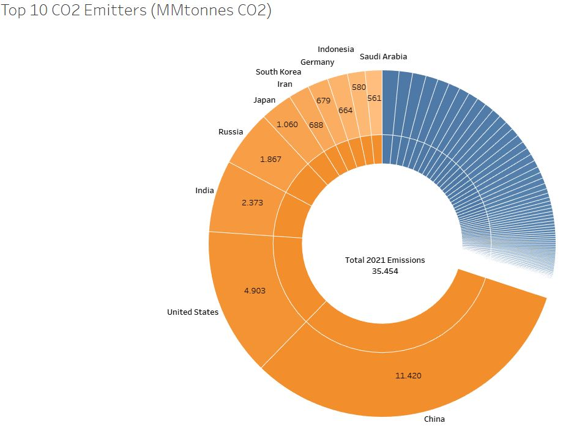

## Introduction

{:style="display:block;margin:0 auto"}

Energy production has surged in recent years due to a notable increase in demand, primarily due to population growth, coupled with rising standards of living and a rapid industrial development. Energy production is closely linked to carbon dioxide emissions, because the dominant sources of energy globally are fossil fuels, like coal, oil and natural gas.

## Data Used
The data was downloaded from the U.S. Energy Information Administration (EIA), and contains information from 1980 to 2021, including energy production by source and country, Gross Domestic Product (GDP) and carbon dioxide emissions (CO2) by country.

## Challenges
There were some Non-Available (NA) data that had to be zeroed out, to make it suitable for analysis. The data had to be rearranged, grouped and new columns were derived in Excel and Python with the Pandas library to make it more understandable and prepare it for exporting to Tableau, where the visualizations were created.

## Tools
* Python and Excel for data cleaning and wrangling.
* Tableau for visualization.

## Questions
* Is there a relationship between energy production and Gross Domestic Product?
* How have energy production and CO2 emissions evolved in the past years?
* Which countries emit the most CO2? How have they changed their emissions and their energy sources mix?
* What is their renewables energy mix?
* How have the CO2 emissions changed in the last years?

## Skills
* Data cleaning and wrangling with Pandas and Excel.
* Data consistency checks.
* Conducting statistical analyses.
* Combining and exporting data.
* Deriving new variables.
* Grouping and aggregating data.
* Data visualization with Python.
* Data visualization with Tableau.

## Goals
* Provide a clear understanding about how energy production and Carbon dioxide emissions are related and their evolution in the past years.
* Provide conclusions consistent with the exploratory analysis.

## Analysis

{:style="display:block;margin:0 auto"}

The world has had a need to increase the production of goods and services to thrive in. This growth in production requires a higher energy consumption and production.
##### * Gross Domestic Product (GDP): Standard measure of the value added created through the production of goods and services in a country during a certain period.
##### * Quad Btu: Unit of energy equal to 1 quadrillion British Thermal Units.

{:style="display:block;margin:0 auto"}

Energy production is one of the sources of CO2 emission. The greenhouse effect is what keeps our temperature ideal for humans, animals, plants and other species to live in. Higher CO2 emissions can tip the greenhouse out of balance, which could increase earth's temperature. In the last forty years, both energy production and CO2 emissions have doubled.

{:style="display:block;margin:0 auto"}

Ten countries were responsible in 2021 for 70% of the total global emissions. China emitted 32% , United States 14% and India 7%.  These countries account to more than half of the total global emissions.

{:style="display:block;margin:0 auto"}

Proportionally to their energy production, Germany, Japan and South Korea emit more CO2 than the other countries in the top 10.

 | 

